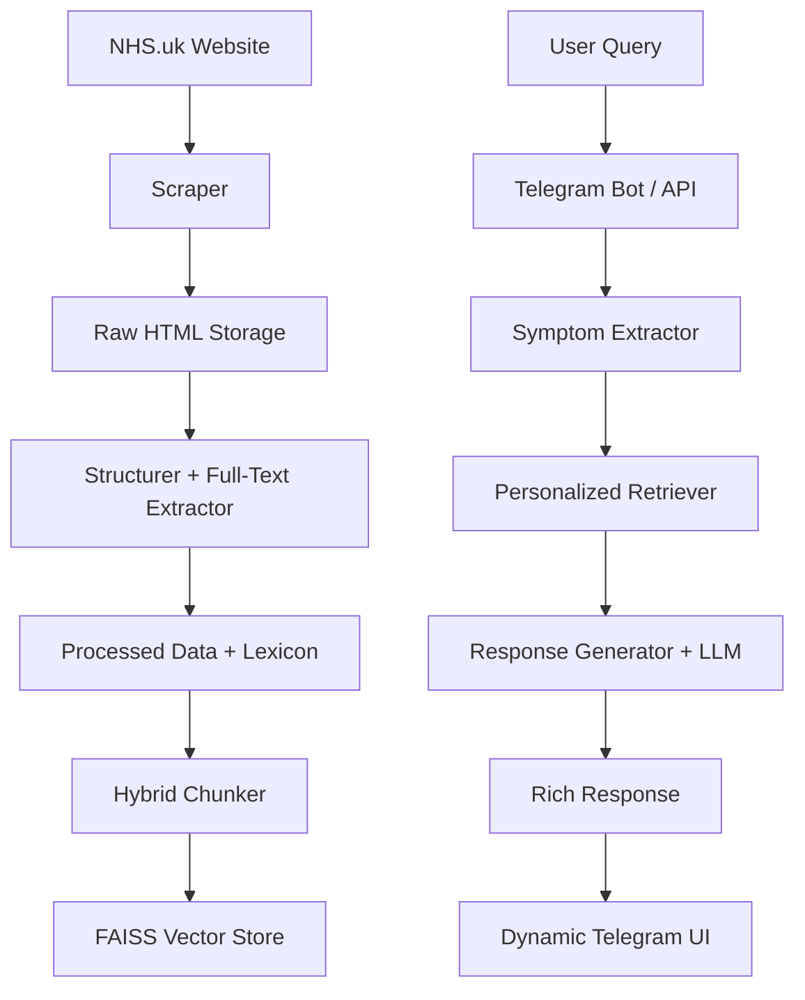
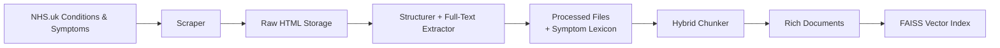
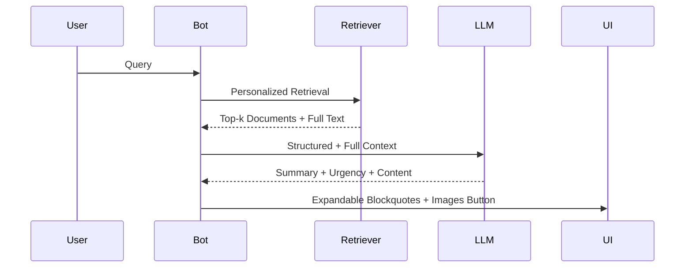

# 🩺 Medical Assistant — Intelligent RAG System

**A production-grade, safe, and personalized medical information assistant** powered by official NHS data using advanced Large-Scale Retrieval-Augmented Generation (RAG).

---

## Key Features

- Real-time **expandable blockquotes** UI on Telegram
- Personalized retrieval (age, chronic conditions, history)
- Dynamic Gemini model rotation on rate limits
- Smart loading animation using Telegram Message Drafts
- High safety with red-flag detection and urgency triage
- Hybrid RAG architecture for maximum accuracy and completeness

---

## System Architecture

### High-Level Architecture



### Layered Architecture

| Layer                  | Components                          | Technologies                          | Responsibility |
|------------------------|-------------------------------------|---------------------------------------|--------------|
| **Ingestion**          | Scraper, Structurer                | BeautifulSoup4, Requests             | Data collection & parsing |
| **Data Processing**    | JSONL + Lexicon Builder            | Python, JSON                         | Structuring + Full-text |
| **Indexing**           | Hybrid Object-as-a-Doc Chunker     | LangChain, FAISS                     | Vector embedding |
| **Retrieval**          | Personalized Retriever             | FAISS + Custom Scoring               | Semantic + Personalization |
| **Generation**         | LLM Manager + Response Generator   | Gemini (multi-model)                 | Safe synthesis |
| **Application**        | Telegram Bot + FastAPI             | Aiogram 3, FastAPI                   | User experience |
| **Safety**             | Red-flag detector, Urgency Triage  | Rules + LLM                          | Medical safety |

---

## 🔧 Data Engineering Design & Flow

### End-to-End Data Pipeline


### Detailed Data Flow

1. **Scraping**  
   - Crawls NHS Conditions A-Z and Symptoms A-Z pages
   - Saves complete raw HTML for every page

2. **Structuring**  
   - Extracts structured fields (`symptoms`, `causes`, `self_care`, `treatment`, etc.)
   - Extracts **full clean page text** (`full_text`)
   - Extracts images with captions
   - Builds semantic symptom lexicon

3. **Chunking Strategy (Hybrid Object-as-a-Doc)**  
   - **One Document = One NHS Page**
   - `page_content`: Clean, well-formatted Markdown (optimized for embeddings)
   - `metadata`: Rich context including `full_text`, structured fields, images, risk level, source URL, etc.

4. **Indexing**  
   - Uses `sentence-transformers/all-MiniLM-L6-v2`
   - Stored in FAISS with cosine similarity

---

## Query-Time Flow



---

## Tech Stack

- **LLM**: Google Gemini (dynamic rotation)
- **Embeddings**: `sentence-transformers/all-MiniLM-L6-v2`
- **Vector DB**: FAISS
- **Bot Framework**: Aiogram 3
- **API**: FastAPI
- **Scraping**: BeautifulSoup4
- **Others**: LangChain, Pydantic, asyncio

---

## Quick Start

```bash
# 1. Setup
pip install -r requirements.txt

# 2. Configure
cp .env.example .env
# → Add GOOGLE_API_KEY and TELEGRAM_BOT_TOKEN

# 3. Ingest Data
python run_ingestion.sh

# 4. Build Index
python scripts/build_index.py

# 5. Run Bot
python -m app.bot.main

# 6. Run API (optional)
uvicorn app.api.main:app --host 0.0.0.0 --port 8080 --reload
```


---

## Safety & Medical Responsibility

- Does **not** diagnose or replace professional medical advice
- Strong red-flag detection and emergency guidance
- Conservative urgency assessment
- Clear disclaimers on every response

> **⚠️ This tool is for informational purposes only. Always consult a qualified healthcare professional.**

---

## Future Roadmap

- Full semantic chunking + Graph RAG
- Multi-language support (Amharic + others)
- User profile persistence with Redis
- Web dashboard
- Voice input

---

**Built with precision, safety, and user experience in mind.**

---
